# React-firebase-notes-app

Notes application developed with react and firebase for authentication and storage of notes

## Developed with 🛠️

_Tools and technologies:_

* [Visual Studio Code](https://code.visualstudio.com/) - Code Editor.
* [Firebase](https://firebase.google.com/?hl=es) - Backend by Google.
* [Mysql](https://getbootstrap.com/) - CSS Framework.

### Weapons: 🚀

* ***Visual Studio Code :***
  * Code editor .
* ***Fire Store :***
  * Backend by Google
* ***WorkBench:***
  
---
## Structure: 🧱

__the app is divided into components located in components managed by app.jsx that after checking if there is a user loads auth or NoteCrud__

* ***App***
  * The central node is **App.jsx** checks if user exists and all routes and auth components are loaded
    the crud of the notes is loaded into the notes component once it is verified that a user exists .

    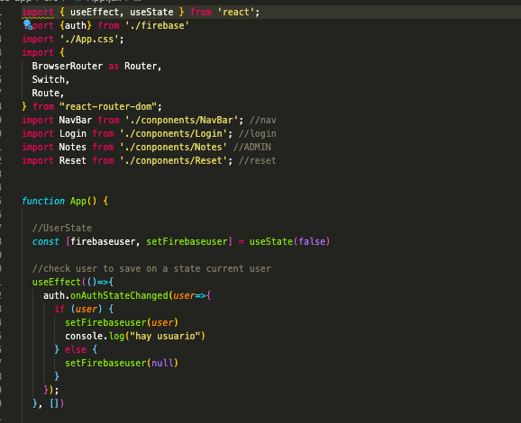

* ***Auth:***
  *  Complemented by Login and reset, these are accessible as long as there is a user registered
    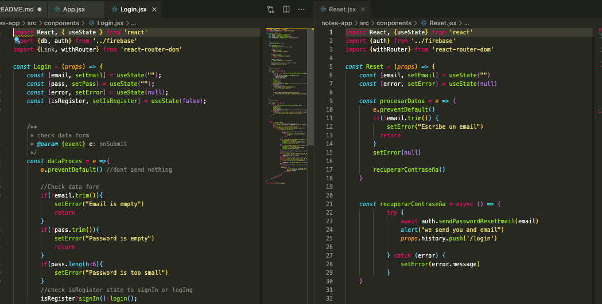
  
  * These are accessible if when loading the notes "/" component there is no registered user .
    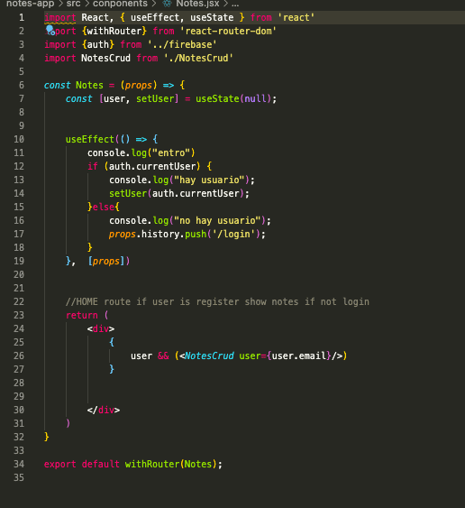

  * in navBar it is checked if there is a user to load in the upper left corner a button to log out .
    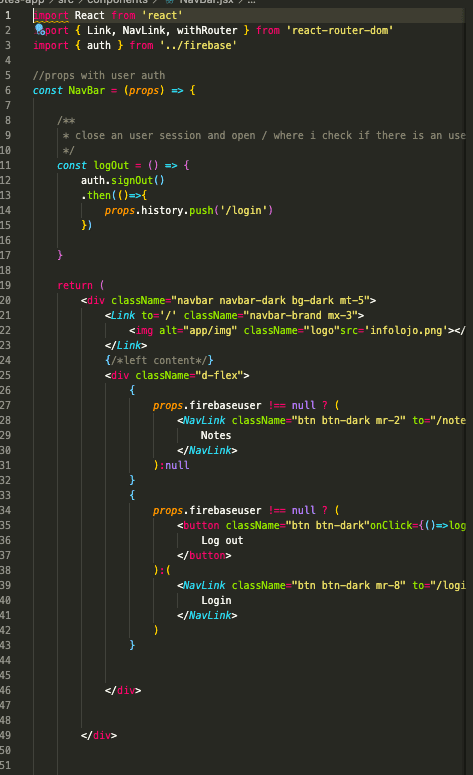

* ***Notes Crud:***
  * When the user is login the notes component is loaded with a props with the user's information
  
    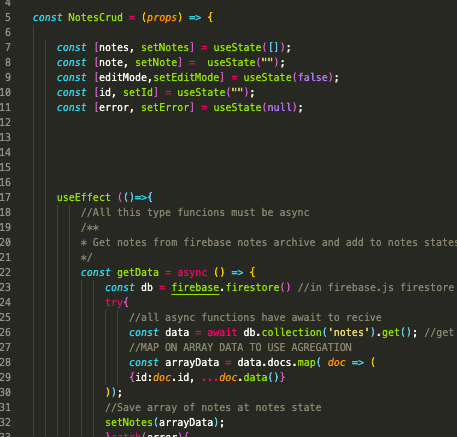

* ***Data Base:***
  * The firebase configuration is in firebase.jsx which is exported to the rest of the project
   
    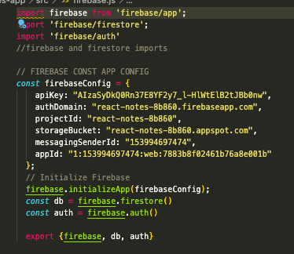

    
---

## What can you do with it 😄
With this web app u can
* Login and Sign in by mail and password
    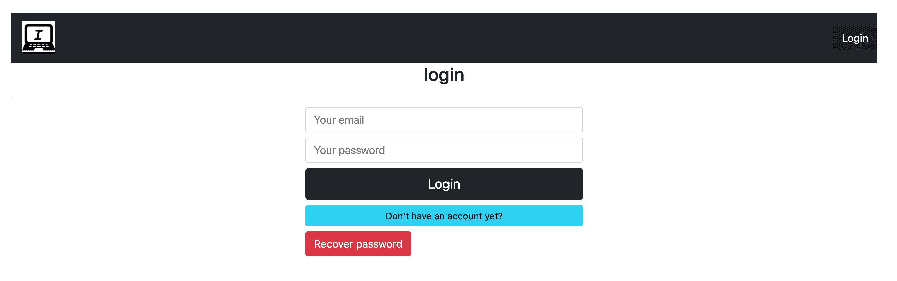
    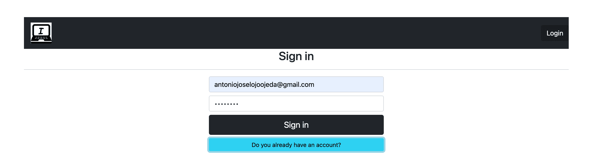
* Reset your password by email if you forgor it
    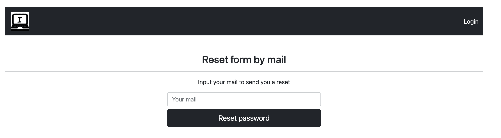
* Add delete and Update your notes
    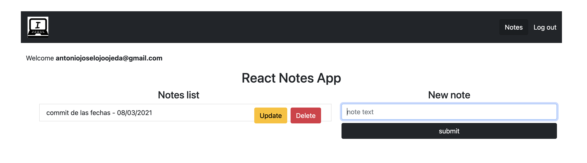
---

## Doplyment 🚀

_Clone repository or download zip_.

Enjoy my app by ***local deploy*** or visit my ***live deploy .***

### Pre-requirements 📋

_0 install node_
```
npm install -g n
```

### install dependencies 🔧

_1 go to proyect folder ***notes-app*** ._

```
cd notes-app
npm install
```

_2 Run my app ._
```
npm start
```

__3 Go to live .__
```
http://localhost:3000
```
### Executing ⚙️

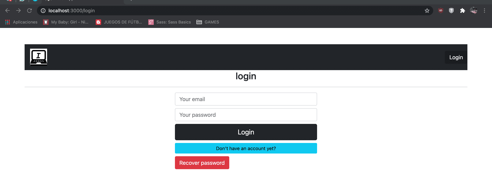


___
## Deplyment 📦
_Just open web app on your browser_ 🤓 .
```
https://thirsty-lichterman-8708ba.netlify.app/
```
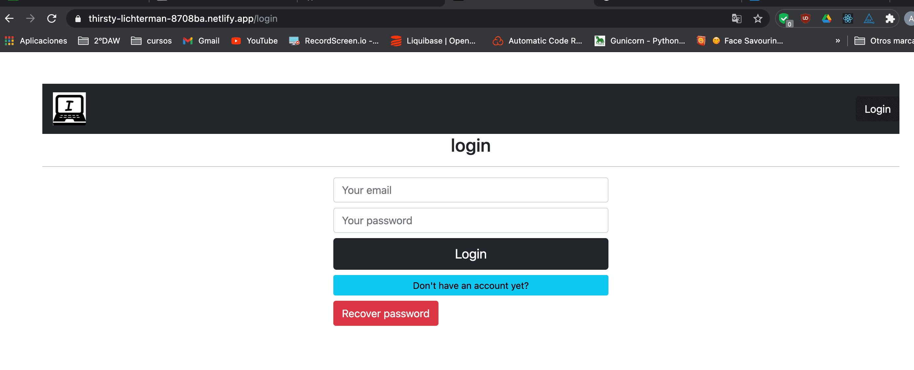

___
## Contributing 🖇️

You can [Fork my work](https://github.com/ajloinformatico) and use it as a base or improve it.


## Web Site 🌐

Visit my personal website and see a little more about me [infolojo.es](https://www.infolojo.es).

## Version Control 📌

Im open source. Just ❤️ GitHub.

## Author ✒️

_This web aplication has been developed by:_

* **Antonio José Lojo Ojeda** - [ajloinformatico](https://github.com/ajloinformatico).


## License 📄
_I'm open source (CC BY-NC) [INFOLOJO](https://www.infolojo.es)._

Use my work as you want but mention and ask me if you want deploy something, 😃

## Thanks 🎁

* Comment with your friends about my work 📢.
* Enjouy it 🍺  ☕ . 
* mention this job in your social networks🤓.
* etc.

---
⌨️ with ❤️ by [INFOLOJO](https://www.infolojo.es) 🧑‍💻.